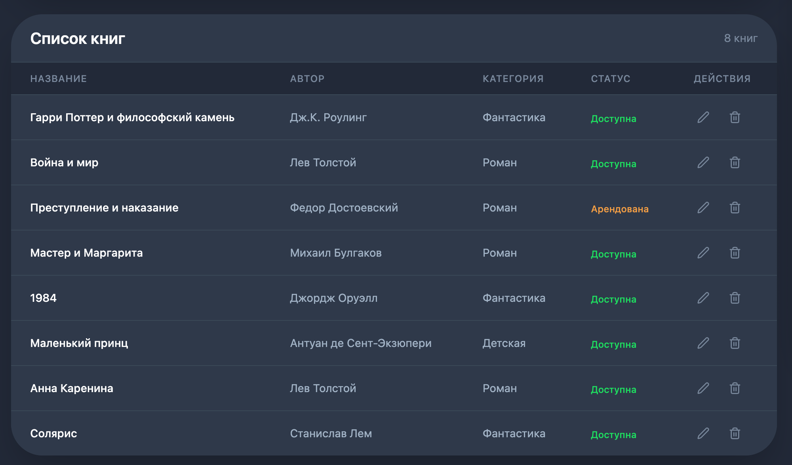
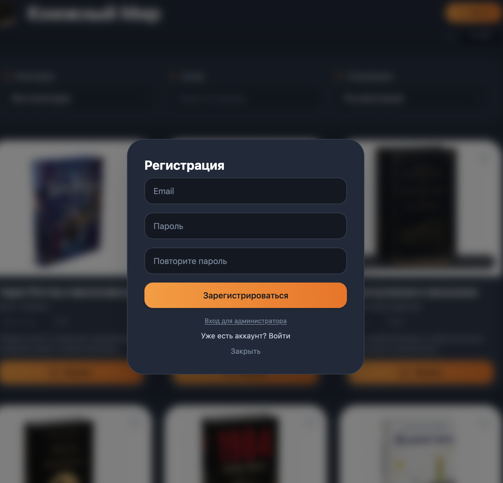

# 📚 BookVerse — электронная библиотека

Веб-приложение для просмотра, фильтрации и аренды книг. Проект включает два интерфейса: пользовательский и административный.

## 🚀 Демо

- **Главная страница** — просмотр всех книг с фильтрацией и сортировкой
- **Страница книги** — подробное описание и аренда
- **Админ-панель** — управление книгами
- **Избранное** — добавление книг в избранное
- **Мои арендованные** — просмотр арендованных книг

---

## 🛠️ Технологии

### Backend
- **Node.js** — среда выполнения
- **Express** — веб-фреймворк
- **MongoDB** — база данных
- **Mongoose** — ODM для MongoDB
- **JWT** — аутентификация
- **bcryptjs** — хеширование паролей

### Frontend
- **React** — библиотека для UI
- **Vite** — сборщик проекта
- **Tailwind CSS** — стилизация
- **React Router DOM** — навигация
- **Lucide Icons** — иконки
- **Axios** — HTTP-запросы

---

## 📋 Функциональность

### Пользователь
- ✅ Просмотр книг в виде карточек
- ✅ Сортировка по категории, автору, году
- ✅ Фильтр "Мои арендованные"
- ✅ Аренда книги на 2 недели, месяц или 3 месяца
- ✅ Страница книги с подробным описанием
- ✅ Избранное с синхронизацией в базе данных
- ✅ Авторизация (регистрация/вход)

### Администратор
- ✅ Добавление книг
- ✅ Редактирование книг
- ✅ Удаление книг
- ✅ Управление ценой
- ✅ Управление статусом (Доступна/Арендована/Недоступна)
- ✅ Автоматические напоминания об окончании аренды (фоновая задача)

---

## 🚀 Запуск проекта

### 1. Клонирование репозитория
```bash
git clone https://github.com/loona113921/book-shop.git
cd book-shop


2. Установка зависимостей
bash
# В корневой папке
npm run install-all
3. Настройка переменных окружения
Создайте файл .env в папке backend:

env
PORT=500
MONGODB_URI=mongodb://localhost:27017/ebook_library
JWT_SECRET=your-secret-key-change-this
4. Запуск MongoDB
bash
# Если установлена локально
brew services start mongodb-community

# Или через Docker
docker run -d --name mongodb -p 27017:27017 mongo:latest
5. Заполнение базы данных
bash
npm run seed
6. Запуск приложения
bash
# Запустить оба сервера одновременно
npm run dev
7. Открыть в браузере
text
http://localhost:5173
🔐 Доступ к админ-панели
Через модальное окно "Вход для администратора":
Логин: admin

Пароль: admin

Или через обычный вход:
Email: admin@admin.com

Пароль: admin123

📁 Структура проекта
text
book-shop/
├── backend/
│   ├── models/
│   │   ├── Book.js          # Модель книги
│   │   └── User.js          # Модель пользователя
│   ├── routes/
│   │   ├── auth.js          # Маршруты авторизации
│   │   ├── books.js         # CRUD книги
│   │   └── favorites.js     # Избранное
│   ├── .env                 # Переменные окружения
│   ├── package.json
│   ├── seed.js              # Заполнение базы данных
│   └── server.js            # Точка входа бэкенда
├── frontend/
│   ├── src/
│   │   ├── api/
│   │   │   └── books.js     # Запросы к серверу
│   │   ├── components/
│   │   │   ├── AuthModal.jsx
│   │   │   ├── BookCard.jsx
│   │   │   ├── BookList.jsx
│   │   │   ├── Filters.jsx
│   │   │   └── Navbar.jsx
│   │   ├── context/
│   │   │   └── AuthContext.jsx
│   │   ├── pages/
│   │   │   ├── HomePage.jsx
│   │   │   ├── BookPage.jsx
│   │   │   └── AdminPage.jsx
│   │   ├── App.jsx
│   │   ├── index.css
│   │   └── main.jsx
│   ├── public/
│   │   └── covers/           # Обложки книг
│   ├── package.json
│   └── tailwind.config.js
├── .gitignore
├── package.json              # Корневой package.json
└── README.md


📸 Скриншоты






📝 Лицензия
MIT © 2026

👤 Автор
Yulia Loonamy

GitHub: @loona113921

Проект: book-shop

🙏 Благодарности
React

Tailwind CSS

Lucide Icons

MongoDB

Vite